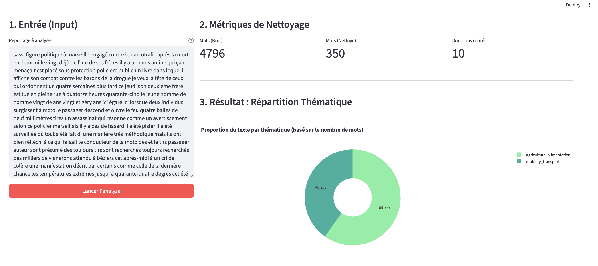
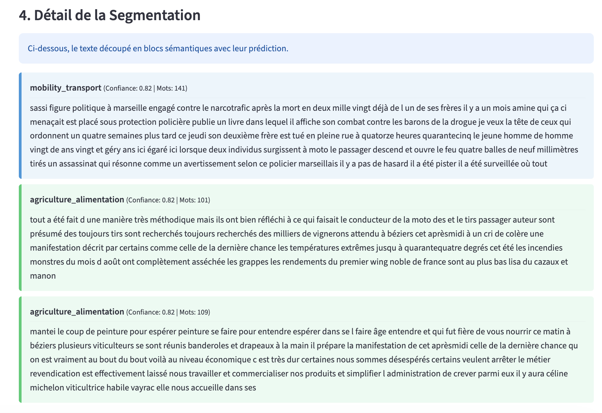

# Hello this is the Placeholder Group

During the Hackathon we mainly explore ways to segment the text.

Entry point to segment the OME dataset : 
```
pip install -r requirements.txt
python placeholder/orchestrator.py
```
It will generate a new dataset in a parquet format.

We also did some work to classify these segments into the categories.

To visualize our work you can do the following command :
```
pip install -r requirements.txt
streamlit run streamlit_app.py
```

Examples : 





# Ideas for the next steps

- establish a small annotated dataset on text segmentation
- create a metric to estimate performances
- test the approach on different types of embeddings (from scikit-learn to sentence transformers)
- based on results estimate the most frugal methods to embed segments and get good results.

I'm available for any question you may have or further work on the subject outside of this Hackathon.
